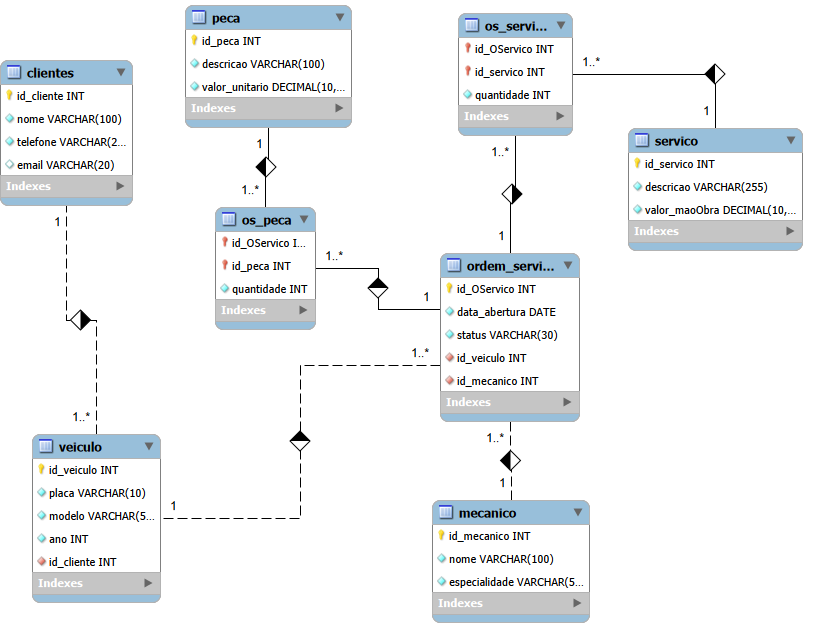

# Projeto Banco de Dados – Oficina Mecânica 🛠️

Este projeto consiste na modelagem e implementação de um sistema de gerenciamento para uma oficina mecânica, cobrindo todo o ciclo de vida do banco de dados.
---

## 📌 Conteúdo do Projeto

O repositório está organizado da seguinte forma:

1.  **Modelo Conceitual:** Diagrama ER detalhando as entidades e relacionamentos.
2.  **Esquema Lógico:** Definição das tabelas, chaves primárias e estrangeiras.
3.  **Script SQL:** Código para criação do banco de dados e inserção de dados.
4.  **Queries SQL:** Consultas para extração de relatórios e métricas.

---
📐 Descrição do Projeto Lógico
O esquema lógico foi derivado do modelo conceitual e implementado seguindo o modelo relacional para garantir a integridade dos dados:

Clientes e Veículos: Relacionamento 1:N (um cliente pode ter vários veículos).

Ordens de Serviço (OS): Entidade central que vincula mecânicos, veículos e serviços realizados.

Tabelas Associativas: Implementadas para resolver relacionamentos N:N, como as peças e serviços vinculados a uma OS.

Integridade: Uso de chaves primárias (PK), estrangeiras (FK) e constraints de verificação (CHECK).

---

## 📐 Modelagem de Dados

### Modelo Entidade-Relacionamento (ER)
Abaixo, a representação visual da estrutura do banco de dados:

> **Nota:** O diagrama contempla entidades como Clientes, Veículos, Ordens de Serviço (OS), Mecânicos, Peças e Serviços.

---

## 🚀 Como Executar o Projeto

Para replicar este banco de dados em seu ambiente local (MySQL, PostgreSQL ou similar), siga os passos abaixo:

### 1. Criação do Esquema
O arquivo principal contém toda a estrutura de tabelas, constraints e relacionamentos. Execute-o em seu gerenciador de banco de dados:

👉 [**Baixar Script de Criação (SQL)**](./esquema_database_oficina.sql)

### 2. Inserção de Dados e Testes
Após criar a estrutura, você pode utilizar o mesmo script (ou o arquivo de inserção, caso decida separar) para popular as tabelas com dados fictícios para testes.

---

## 🔍 Exemplos de Consultas (Queries)

O projeto inclui análises de dados como:

* **Recuperação simples:** Listagem de todos os veículos e seus respectivos donos.
* **Filtros (Where):** Buscar ordens de serviço abertas com valor superior a R$ 500,00.
* **Atributos Derivados:** Cálculo do valor total de uma OS (Mão de obra + Peças).
* **Ordenação:** Ranking de mecânicos por quantidade de serviços realizados.
* **Filtros em Grupos (Having):** Listar serviços que aparecem em mais de 5 ordens de serviço.
* **Junções (Joins):** Relatório completo unindo Cliente, Veículo e status da Ordem de Serviço.

---

## 🛠️ Tecnologias Utilizadas

* **SQL** (Linguagem de consulta)
* **MySQL / Workbench** (Ou outra ferramenta que você utilizou)
* **Git & GitHub** (Versionamento)
